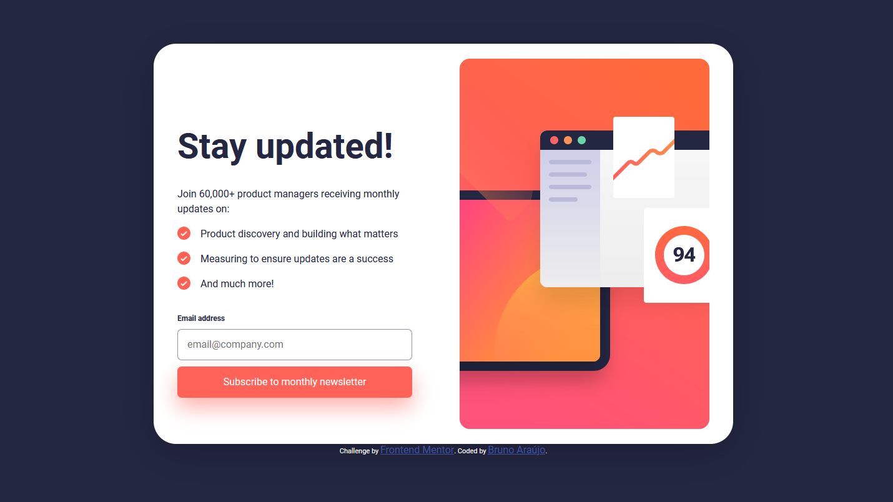
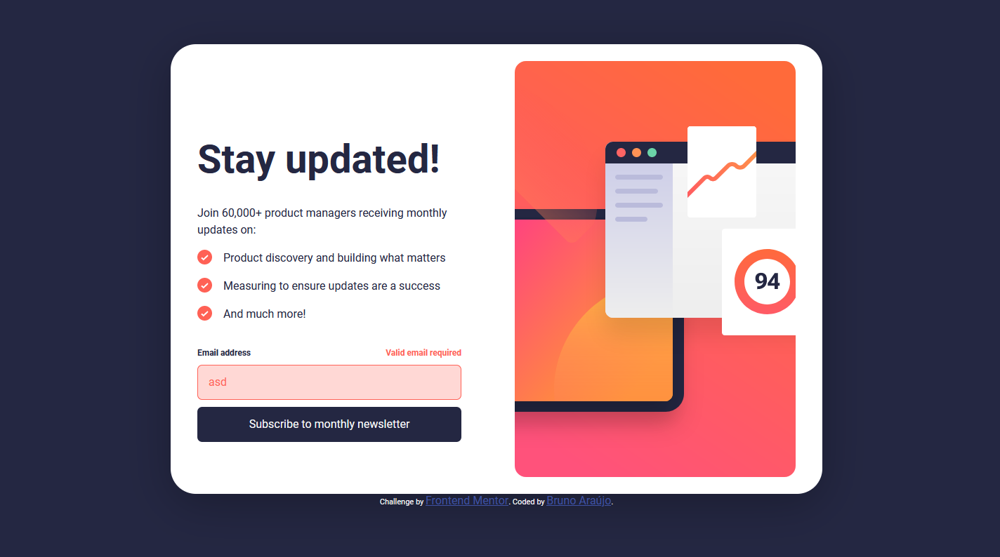
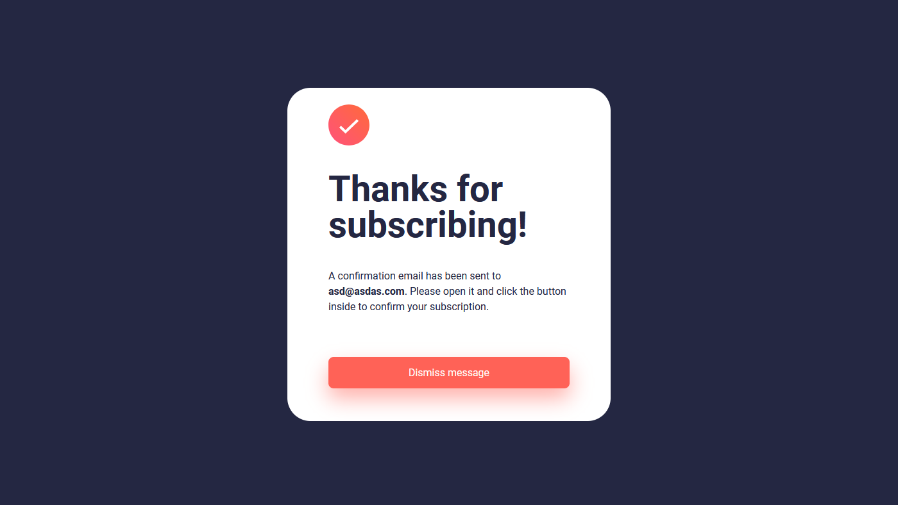
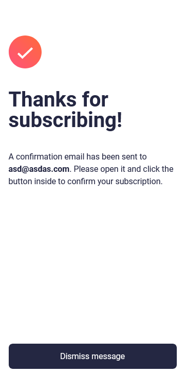

# Frontend Mentor - Newsletter sign-up form with success message solution

This is a solution to the [Newsletter sign-up form with success message challenge on Frontend Mentor](https://www.frontendmentor.io/challenges/newsletter-signup-form-with-success-message-3FC1AZbNrv). Frontend Mentor challenges help you improve your coding skills by building realistic projects. 

## Table of contents

- [Overview](#overview)
  - [The challenge](#the-challenge)
  - [Screenshot](#screenshot)
  - [Links](#links)
- [My process](#my-process)
  - [Built with](#built-with)
  - [What I learned](#what-i-learned)
- [Author](#author)

## Overview

### The challenge

Users should be able to:

- Add their email and submit the form
- See a success message with their email after successfully submitting the form
- See form validation messages if:
  - The field is left empty
  - The email address is not formatted correctly
- View the optimal layout for the interface depending on their device's screen size
- See hover and focus states for all interactive elements on the page

### Screenshot








### Links

- Live Site URL: [Add live site URL here](https://your-live-site-url.com)

## My process

### Built with

- Semantic HTML5 markup
- CSS custom properties
- Flexbox
- [CSS BEM methodology](https://en.bem.info/methodology/quick-start/)
- Mobile-first workflow

### What I learned

During the development of this project, I had the opportunity to acquire a range of knowledge and enhance my skills in various areas. In this section, I will highlight some of the major learnings along with code samples to illustrate key points.

#### Utilizing CSS Variables and BEM Methodology

One of the key takeaways from this project was the effective use of CSS variables and the BEM (Block Element Modifier) methodology for class naming. By utilizing CSS variables declared in the :root selector, I could centralize color definitions and easily apply them throughout the project.

CSS Code Sample:

```css
:root {
  --primary-tomato: hsl(4, 100%, 67%);
  --primary-tomatoDark: hsla(4, 100%, 67%, 0.25);
  --darkSlateGrey: #242742;
  --charcoalGrey: hsl(235, 18%, 26%);
  --grey: hsl(231, 7%, 60%);
  --white: hsl(0, 0%, 100%);
}

.form__title {
  color: var(--darkSlateGrey);
  font-weight: 700;
  font-size: 56px;
  line-height: 100%;
}

.form__text {
  display: flex;
  color: var(--darkSlateGrey);
  font-weight: 400;
  line-height: 150%;
}
```

#### Manipulating the DOM and Client-Side Data Validation

Another significant learning point was the manipulation of the DOM to add or remove classes dynamically. This allowed me to create interactive user experiences by updating the appearance or behavior of elements in response to user actions.

JavaScript Code Sample:

```js
function validation() {
  var emailInput = document.getElementById("email-input");
  var spanAlert = document.getElementById("spam-alert");

  if (emailInput.value === "") {
    emailInput.classList.add("form__input-invalid");
    spanAlert.classList.add("form__invalidText-active");
    return false;
  } else if (!validateEmail(emailInput.value)) {
    emailInput.classList.add("form__input-invalid");
    spanAlert.classList.add("form__invalidText-active");
    return false;
  } else {
    emailInput.classList.remove("form__input-invalid");
    spanAlert.classList.remove("form__invalidText-active");
    return true;
  }
  emailConfirmation();
}
```

## Author

- Frontend Mentor - [@Brunoalaraujo](https://www.frontendmentor.io/profile/Brunoalaraujo)
- LinkedIn - [Bruno Andrade Lima de Araújo](https://www.linkedin.com/in/brunoandradel-a-dev)
